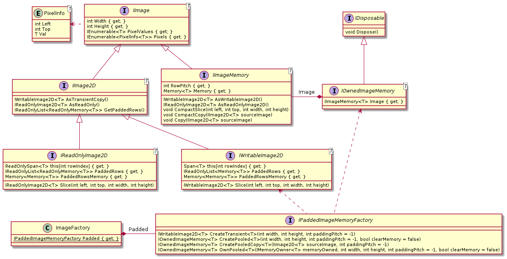

# Memory Frame #

## Intro ##

Images are stored in memory as arrays. There are many ways to deal with these arrays. Good **performance and maintainability** of systems dealing with large arrays of data require a strategy. A good strategy involves many topics. This library was created as a result of a study to explore these topics on the .NET platform.

## Topics ##

* Managed memory and the Garbage Collector
* Interop with unmanaged libraries
  * C++ algorithms
  * Cognex
* Interop with unmanaged memory
  * Memory allocated on unmanaged heap and shared with both .NET and unmanaged libraries
  * Bitmap
* Buffer Pooling
* SIMD (Single Instruction Multiple Data)
* Streaming inter process communication

## .NET Technologies ##

* Managed arrays
  * *Single continuous array*: They are allocated in the LOH (Large Object Heap), if larger than 85000 bytes. Allocation time is dominated by zeroing the data. LOH fragmentation can result in slowing down allocations and inefficient use of CPU and memory resources: Intermittent latencies in execution; Unused private memory; Increase of "% time in GC".
  * *Jagged array*: They are allocated on the heap. Allocation is dominated by zeroing the data. Memory can be freed up very fast. If the memory is referenced for a long time, the data is promoted to 1st or 2nd generation heap. This decreases the efficiency of the Garbage Collector.
* Slicing with `Span<T>` or `Memory<T>`.
  * Allow algorithms to use simple indexing
    * Per column and row *(Regardless of underlaying memory data type)*
    * One dimensional sequence of pixels *(Requires using single continuous memory as underlaying data type)*
  * Allow single algorithm implementations to support multiple types of arrays: Managed; Unmanaged; Jagged array; Single array
  * Allow single algorithm implementations to work on a slice of an images, without copying the data.
* Buffer pool
  * Allow reuse of large single arrays in order to reduce GC performance loss. [link](https://docs.microsoft.com/en-us/dotnet/api/system.buffers.arraypool-1?view=net-6.0)
* Vector calculations (SIMD)
  * Allow calculations on multiple pixels with one CPU instruction.
* Padding (vector address alignment)
  * Allow algorithms, using vector calculations (SIMD), to be simple. The algorithms should not have to implement the same logic twice. Once for the vector aligned pixels and once for the non-vector aligned pixels.
* gRPC image streams
  * Allow transfer of buffers to be used by algorithms, without having to copy the buffers.
* MemoryMarshal.Cast
  * Use .NET framework for safe casts between e.g.
    * `byte[]` to `float[]` (Useful for serialization cases)
    * `float[]` to `Vector<float>` (SIMD)
    * `Span<float>` to `Span<Vector<float>>` (SIMD)

## Putting it together ##

Goals:

* Single algorithm implementation can be used for many data sources.
* Enable algorithms to treat an image as a single array of pixels.
* Enable algorithms to treat an image as an array of rows with pixels.
* End-to-end omit copying to different array type.
* It should be easy to make software perform (CPU; Memory).
* Enable slicing of images without copying the data.

How:

* Create a YS-Image type for transparently supporting all types of arrays. (Managed; Unmanaged; Jagged; Continuous; Padded; Sliced; Pooled)
* Support consuming existing pooled memory instances via `IMemoryOwned<T>` type.
* Create a reusable buffer stream gRPC library
  * Leases a pooled continuous array.
  * Bytes in the array are transferred in a stream of slices, for optimal usage of resources and minimal latency.
* Rows in the array are padded, in order to make all pixels part of a vector (SIMD) operation. This enables algorithms to be more maintainable and be more performant. There is no need for a non-vectorized copy of the algorithm, that needs to deal with the pixels at the end.
* The pooled array is owned by the YS-Image, until it is released and the array is returned to the pool.
* Provide 1-dimentional and 2-dimantional views on images.
  * Only 2-dimentional is possible in case of Jagged array.
* Provide slicing of images, where original sources are encapsulated and represented as `Memory<T>`.
* Provide a compacting feature on sliced images, so elements (pixels) are moved in such a way that all the elements are in a continuous region of memory.
  * Enables performant and maintainable algorithms that treat images as a single sequence of pixels.
  * No new buffer has to be allocated.
* Protobuf v3.15 or higher to be able to create a ByteString that references an existing `Memory<T>`.

API:

Details:

* `Span<T>` is stack-only and provides the fast array like API, while `Memory<T>` can exist on the heap and can thus be part of reference types.

## Links ##

| Link | Description |
| ----------- | ----------- |
[Memory\<T\> and Span\<T\> usage guidelines (Microsoft Docs)](https://docs.microsoft.com/en-us/dotnet/standard/memory-and-spans/memory-t-usage-guidelines) | Guideline for using `Span<T>`, `Memory<T>`, `IMemoryOwner<T>`, and `MemoryPool<T>` |
